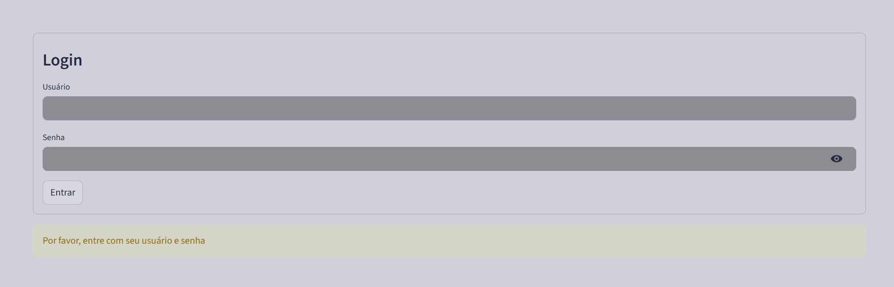
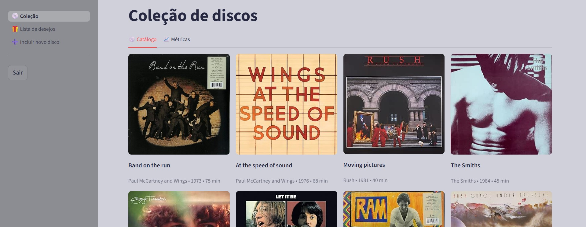
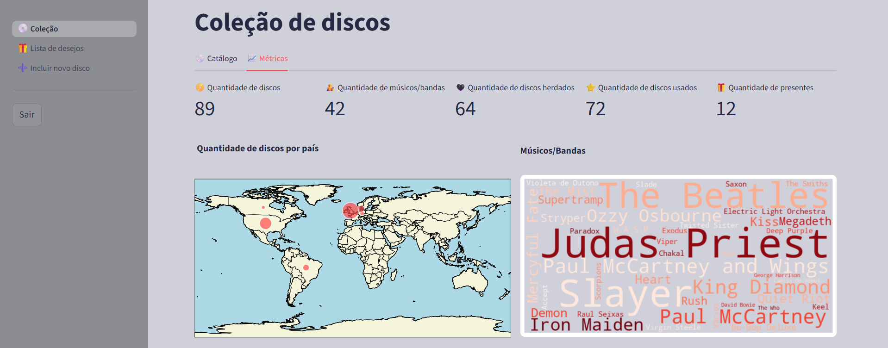
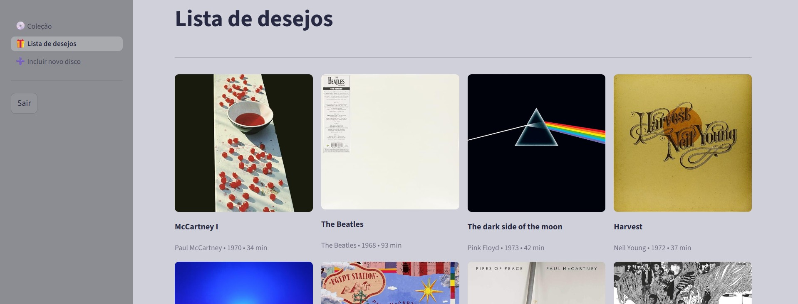
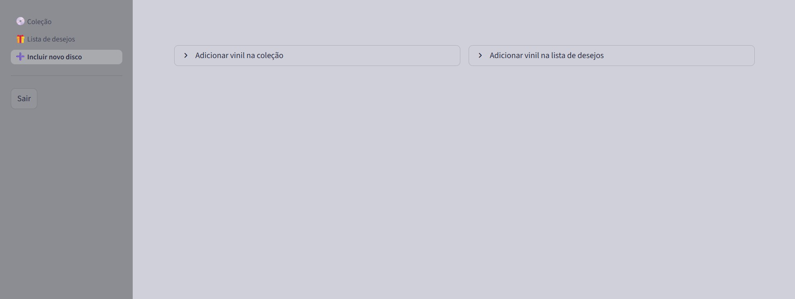
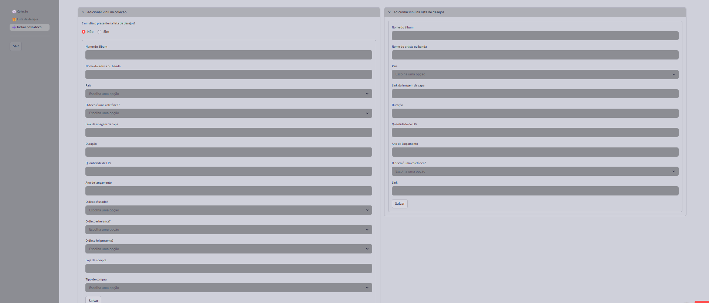

# Plataforma de discos de vinil
Repositório com meu dashboard de catálogo da coleção, lista de desejos e inclusão dos meus discos de vinil.

## Descrição do projeto

Este projeto é uma plataforma web criada para catalogar minha coleção de discos de vinil e disponibilizar a minha lista de desejos. Para a correta catalogação e atualização da lista de desejos, é possível adicionar novos discos, em ambas as bases, por ela.

## Funcionalidades

- Catálogo da coleção e aba de métricas e gráficos sobre a coleção;

- Lista de desejos;

- Modal para inclusão de novos discos na coleção;

- Modal para inclusão de novos discos na lista de desejos.

## Tecnologias utilizadas

* **Linguagem:** Python
* **Principais bibliotecas:** streamlit, pandas
* **"Banco de dados":** GoogleSheets (usando o conector do streamlit com o google sheets)

## Páginas

### Página de login

Uma vez que essa plataforma é apenas para mim e para quem eu quiser que tenha acesso, implementei uma página de login.

### Página do catálogo e da aba de métricas

Abaixo, pode-se ver uma parte da coleção e mais abaixo uma parte da aba do dashboard de métricas.

### Página da lista de desejos

Abaixo, pode-se ver uma parte da lista de desejos.

### Página de inserção de disco na coleção ou na lista de desejos

Abaixo, pode-se ver os dois modais de inserção de discos.

Caso o disco a ser inserido no catálogo já exista na lista de desejos, as informações que já temos sobre ele na lista de desejos já são pré preenchidas no modal de inserção de novo disco na coleção. Só restaria preencher informações adicionais, como loja da compra, data que entrou na coleção, etc.
